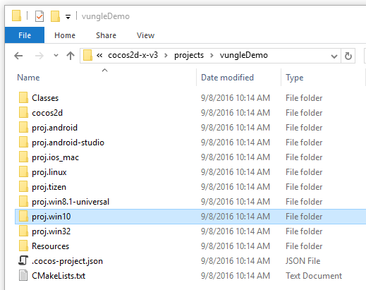
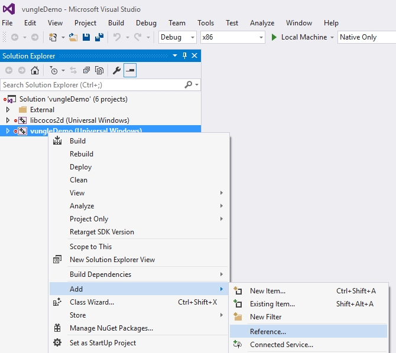
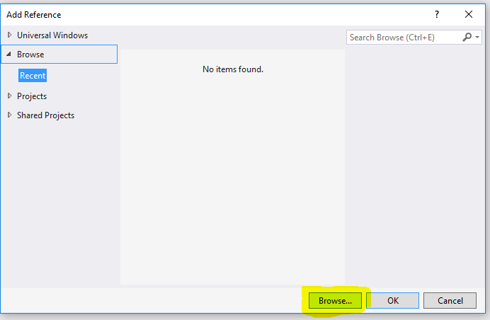
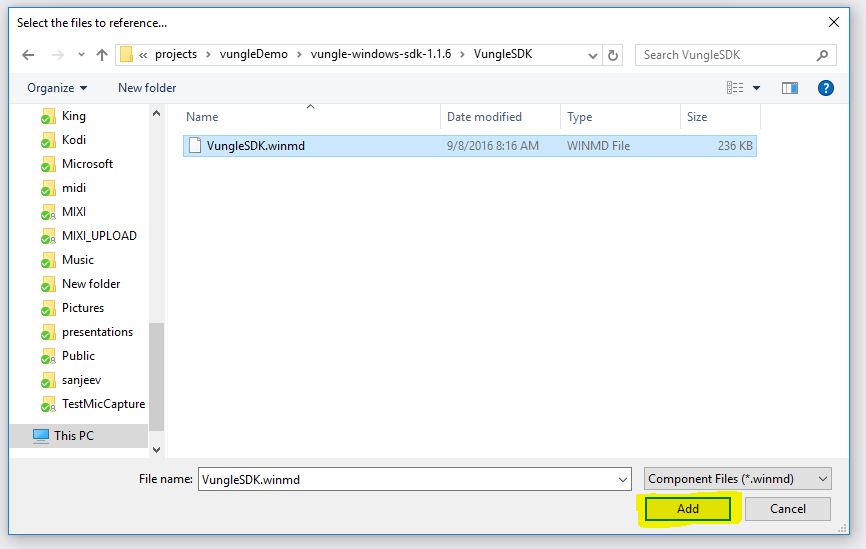
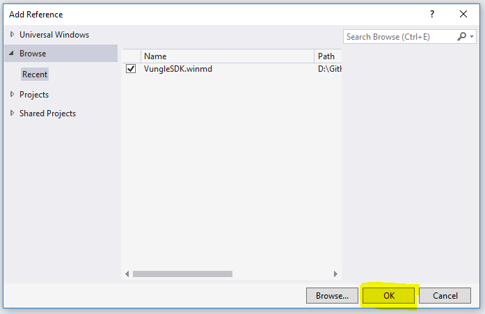
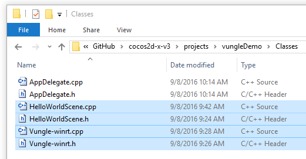
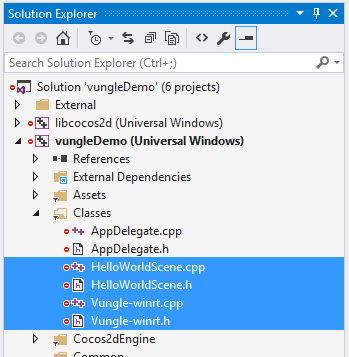
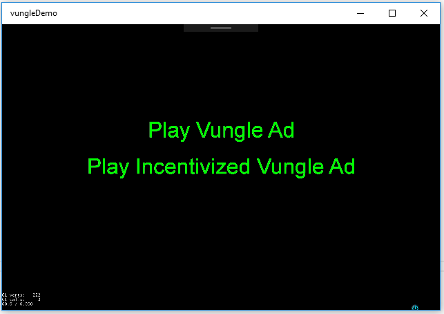

# Windows 10 UWP Vungle Plugin for Cocos2d-x Apps


This GitHub repo implements a [SDKBOX](http://www.sdkbox.com/) style plugin for Windows 10 UWP Cocos2d-x apps using the [Vungle Windows SDK](https://v.vungle.com/sdk). 
Please note that this plugin is not integrated into the SDKBOX system so you will need to manually add it to your Cocos2d-x Windows 10 UWP app project following the instructions below.
Future versions of this plugin may automate part of the installation process.

This plugin implements the same API as the [SDKBOX Vungle plugin](http://docs.sdkbox.com/en/plugins/vungle/v3-cpp/) with a few minor changes to accommodate the Windows 10 UWP app framework.

##Vungle Demo Setup##

In order to learn how to integrate the Vungle plugin into your Windows 10 UWP Cocos2d-x app, it is recommended that you first go through the steps to create a demo app.

1. Download or clone this repo.

1. Create a new Cocos2d-x project.

    ```
	$ cocos new vungleDemo -l cpp -d projects
    ```

1. Download the [Vungle Windows SDK](https://v.vungle.com/sdk). Unzip the SDK and put the folder in your vungleDemo Project folder.

1. Open the Windows 10 UWP vungleDemo solution in your project's proj.win10 folder.

	
    
1. Right click on the vungleDemo project and navigate to the **Add | Reference** menu item.

	
    
1. Click on the Browse button in the Add Reference window.

	

1. Navigate to **vungleDemo/vungle-windows-sdk-1.1.6/VungleSDK** folder and select the **VungleSDK.winmd** file. 
Click the **Add** button to add a reference to the Vungle SDK.

	

1. Click the **OK** button to finish adding the reference to the Vungle SDK.

	

1. Copy the sdkbox_config.json file in this repo's Resource folder into your project's Resource folder. 
If you already have a sdkbox_config.json for other platforms, copy the WinRT section into your sdkbox_config.json file.

1. Copy the files in this repo's Classes folder into your project's Classes folder.

	
    
1. Add the new Classes files to the Classes folder in your vungleDemo project

	

1. Select the Debug | x86 project configuration. Build and run the solution.

	
    
1. When the menu items turn green, click on the **Play Vungle Ad** menu item. If the menu items are red, then the Vungle SDK is not ready to play an ad.

	
    
1. For an example on how to use the Windows 10 UWP Vungle plugin in your app, take a look at the following files:
 
* [HelloWorldScene.cpp](https://github.com/stammen/win10-vungle-sdkbox/blob/master/Classes/HelloWorldScene.cpp)
* [HelloWorldScene.h](https://github.com/stammen/win10-vungle-sdkbox/blob/master/Classes/HelloWorldScene.h) 

##Adding Your Vungle App Id##

1. The vungleDemo uses the Vungle test app id. In order to specify your Vungle app id, you need to open the **vungle.json** file in the **Resources/sdkbox/** folder. 
Add your Vungle app id to the "id" field (currently set to "vungleTest"). The JSON format is similar to the one used by the iOS and Android Vungle plugins.

    ```json
    {
      "Vungle" :
      {
          "id":"vungleTest",
          "ads":{
              "video":{
                "sound" : true
              },
              "reward":{
                 "sound" : true,
                 "incentivized" : true
              }
          }
      }
    }
    ```


